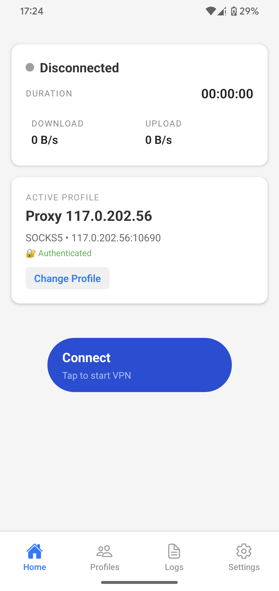
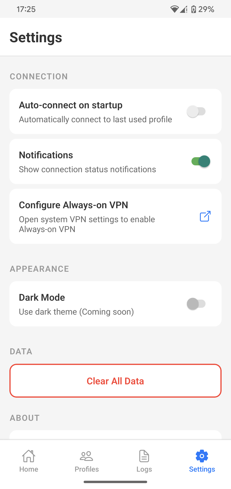

# CB Pro Proxy

[](https://opensource.org/licenses/MIT)
[](https://github.com/yourusername/cbv-vpn-app)
[](https://github.com/yourusername/cbv-vpn-app)
[](https://github.com/yourusername/cbv-vpn-app)
[](https://reactnative.dev/)
[](https://expo.dev/)
[](https://www.typescriptlang.org/)
[](https://github.com/yourusername/cbv-vpn-app)
[](https://github.com/yourusername/cbv-vpn-app/pulls)

**English documentation** — Vietnamese version available at [`README.vi.md`](./README.vi.md).

CB Pro Proxy is an Expo-managed React Native application that provisions a local VPN interface and forwards traffic through SOCKS5 or HTTP proxies. The Android implementation ships with a fully native `VpnService` pipeline, and the iOS implementation now includes a complete Network Extension framework with packet tunnel provider.

## Product Overview

CB Pro Proxy revolutionizes proxy management on mobile devices by enabling seamless remote control through Android Debug Bridge (ADB). Tailored for developers, QA engineers, and automation specialists, this app allows you to create, start, and stop proxy profiles directly from your command line or scripts, making it perfect for device farming, automated testing, and CI/CD pipelines.

### Why ADB Control Matters

- **Automation-First Design**: Integrate proxy switching into your test suites and deployment scripts without touching the device.
- **Device Farm Ready**: Manage proxies across multiple Android devices simultaneously via ADB broadcasts.
- **No Manual Intervention**: Start VPN tunnels, add profiles, and monitor status remotely – ideal for headless environments.
- **Secure & Efficient**: Credentials are stored securely, and connections are handled natively for optimal performance.

Whether you're running Selenium tests, Appium scripts, or custom automation workflows, CB Pro Proxy bridges the gap between your development tools and mobile proxy needs.

---

## Screenshots

<p align="center">
  
  
</p>

---

## Key Features

- **Multi-profile proxy manager** — Create, update, and delete SOCKS5 or HTTP proxy profiles.
- **Native VPN tunnel** — Android foreground service with status bar notification and connection telemetry.
- **Credential security** — Metadata in `AsyncStorage`, secrets in `SecureStore` (Keychain on iOS).
- **Remote automation** — Full control via `adb` broadcast intents; designed for STF/device-farm workflows.
- **React Native UI** — Zustand-powered state management, modern screens, realtime connection stats.

---

## Requirements

- Node.js 18+
- npm or Yarn Classic (Yarn Berry ≥2 requires `yarn add -D metro-minify-terser`)
- Expo CLI (`npx expo`)
- Android Studio (emulator, SDK platforms)
- Xcode 15.4+ (for iOS development)
- CocoaPods (for iOS dependencies)

---

## Quick Start

### Expo Managed Workflow with Native Modules

This project uses **Expo prebuild** to integrate custom native VPN modules.

```bash
# Clone & install
git clone <repository-url>
cd CB-Pro-Proxy
npm install

# Generate native projects (iOS + Android)
npx expo prebuild

# For iOS: Install CocoaPods dependencies
cd ios && pod install && cd ..

# Run on device
npm run ios     # iOS (requires Xcode)
npm run android # Android
```

### Development with Hot Reload

```bash
# Build dev client once
npx expo run:ios    # or npm run ios
npx expo run:android # or npm run android

# Then use dev server for fast refresh
npm start
# Press 'i' for iOS, 'a' for Android
```

> **Important:**
> - ⚠️ **Expo Go not supported** - Native VPN modules require custom dev build
> - 📖 See [EXPO_PREBUILD_GUIDE.md](./EXPO_PREBUILD_GUIDE.md) for detailed workflow
> - 🔧 iOS Network Extension requires manual Xcode configuration (see [ios/XCODE_SETUP_REQUIRED.md](./ios/XCODE_SETUP_REQUIRED.md))

---

## Project Structure

```
cbv-vpn-app/
├── src/
│   ├── components/            # Shared UI components (alerts, notifications, loaders, ...)
│   ├── screens/               # React Navigation screens (profiles, settings, logs)
│   ├── navigation/            # AppNavigator & stack/tab config
│   ├── services/              # Business logic (StorageService, CryptoService, ErrorHandler)
│   ├── store/                 # Zustand store (`vpnStore.ts`)
│   ├── hooks/                 # Hooks (`useVPNEvents`)
│   ├── native/                # JS bridge to native module (`VPNModule.ts`)
│   └── types/                 # Shared TypeScript definitions
├── android/                   # Native Android module & VpnService implementation
├── ios/                       # iOS Network Extension implementation (Xcode setup required)
├── assets/                    # Icons & splash artwork
└── app.json / package.json    # Expo & dependency configuration
```

---

## Native Integration & ADB Control

Android exposes a broadcast receiver (`VPNIntentReceiver.kt`) with explicit intent actions:

- `com.cbv.vpn.ADD_PROFILE`
- `com.cbv.vpn.START_VPN_BY_NAME`
- `com.cbv.vpn.START_VPN_BY_ID`
- `com.cbv.vpn.STOP_VPN`
- `com.cbv.vpn.GET_STATUS`

Example intent sequence:

```bash
# Add or update a profile
adb shell am broadcast -n com.cbv.vpn/.VPNIntentReceiver \
  -a com.cbv.vpn.ADD_PROFILE \
  --es profile_name "My Proxy" \
  --es profile_host "203.0.113.10" \
  --ei profile_port 1080 \
  --es profile_type "socks5" \
  --es profile_username "user" \
  --es profile_password "secret"

# Start VPN by name (auto-stops previous session)
adb shell am broadcast -n com.cbv.vpn/.VPNIntentReceiver \
  -a com.cbv.vpn.START_VPN_BY_NAME \
  --es profile_name "My Proxy"

# Stop VPN
adb shell am broadcast -n com.cbv.vpn/.VPNIntentReceiver \
  -a com.cbv.vpn.STOP_VPN
```

See [`ADB_INTENT_COMMANDS.md`](./ADB_INTENT_COMMANDS.md) for the full catalogue, automation tips, and troubleshooting notes.

---

## Build for Production

### Manual Build

#### Android

```bash
npx expo prebuild --platform android
cd android
./gradlew assembleRelease     # Generate APK
./gradlew bundleRelease       # Generate AAB for Play Store
```

#### iOS

```bash
npx expo prebuild --platform ios
cd ios
pod install
open CBVVPN.xcworkspace       # Configure Network Extension target in Xcode
```

⚠️ **Important**: iOS implementation requires manual Xcode configuration. See [`ios/XCODE_SETUP_REQUIRED.md`](./ios/XCODE_SETUP_REQUIRED.md) for detailed setup instructions.

### CI/CD with GitHub Actions

Automated builds are configured for both platforms:

- **Android APK**: `.github/workflows/build-android.yml`
- **iOS IPA**: `.github/workflows/build-ios.yml`

**Setup GitHub Secrets:**
See [`.github/SECRETS.md`](./.github/SECRETS.md) for complete list of required secrets:

- Android: `ANDROID_KEYSTORE_BASE64`, `ANDROID_KEYSTORE_PASSWORD`, etc.
- iOS: `IOS_CERTIFICATE_BASE64`, `IOS_PROVISIONING_PROFILE_BASE64`, etc.

**Trigger Builds:**
```bash
# Push to main branch
git push origin main

# Or create a release tag
git tag v1.0.0
git push origin v1.0.0
```

Artifacts will be uploaded to GitHub Actions and releases will be created for tags.

---

## Architecture Overview

- **React Native layer** — UI, profile management workflow, Zustand store, event-driven updates through `useVPNEvents`.
- **Storage & security** — Profile metadata synced via `StorageService`, credentials isolated in secure storage.
- **Native Android** — `VPNConnectionService` (derives from `VpnService`), packet routing, proxy clients, explicit broadcast receiver for automation, foreground notification for compliance.
- **Native iOS** — Network Extension with `NEPacketTunnelProvider`, SOCKS5/HTTP proxy handlers, App Group data sharing, VPN Manager using NetworkExtension framework. See [`ios/iOS_PROXY_IMPLEMENTATION.md`](./ios/iOS_PROXY_IMPLEMENTATION.md) for details.

---

## Development Status

- **Android**: Production-ready (`VpnService`, SOCKS5/HTTP tunnelling, broadcast automation, telemetry).
- **iOS**: Implementation complete (Network Extension, packet tunnel provider, SOCKS5/HTTP handlers). Requires Xcode configuration and optional tun2socks integration for production deployment.
- **Roadmap**: Full packet routing optimization (tun2socks), enhanced error analytics, multi-proxy rotation, UI polish.

### iOS Implementation Notes

The iOS proxy implementation includes:
- ✅ VPNModule React Native bridge
- ✅ Network Extension PacketTunnelProvider
- ✅ SOCKS5 proxy handler (RFC 1928, RFC 1929)
- ✅ HTTP CONNECT proxy handler
- ✅ Profile storage with App Groups
- ✅ VPN lifecycle management
- ⚠️ Requires manual Xcode project configuration
- 💡 Consider integrating [go-tun2socks](https://github.com/shadowsocks/go-tun2socks) for production-grade packet routing

See [`ios/iOS_PROXY_IMPLEMENTATION.md`](./ios/iOS_PROXY_IMPLEMENTATION.md) for complete implementation details and [`ios/XCODE_SETUP_REQUIRED.md`](./ios/XCODE_SETUP_REQUIRED.md) for setup instructions.

---

## Troubleshooting Highlights

- **VPN permission dialog** — Android prompts the first time `VpnService.prepare()` returns an intent; automation flow opens the app if approval is pending.
- **Expo Go limitation** — Requires development client or production build due to custom native modules.
- **No traffic after connect** — Verify upstream proxy availability and credentials; inspect logcat with `adb logcat | grep VPN`.
- **Build issues** — Refer to [`TROUBLESHOOTING.md`](./TROUBLESHOOTING.md) for common Gradle/Xcode remedies.

---

## Documentation

### Core Documentation
- 📖 [**EXPO_PREBUILD_GUIDE.md**](./EXPO_PREBUILD_GUIDE.md) - Complete guide for Expo prebuild workflow
- 📖 [**ADB_INTENT_COMMANDS.md**](./ADB_INTENT_COMMANDS.md) - Android automation via ADB broadcasts
- 📖 [**TROUBLESHOOTING.md**](./TROUBLESHOOTING.md) - Common issues and solutions

### iOS-Specific
- 🍎 [**ios/iOS_PROXY_IMPLEMENTATION.md**](./ios/iOS_PROXY_IMPLEMENTATION.md) - Technical implementation details
- 🍎 [**ios/XCODE_SETUP_REQUIRED.md**](./ios/XCODE_SETUP_REQUIRED.md) - Step-by-step Xcode configuration
- 🍎 [**ios/configure-network-extension.sh**](./ios/configure-network-extension.sh) - Configuration helper script

### CI/CD
- 🔧 [**.github/SECRETS.md**](./.github/SECRETS.md) - GitHub Actions secrets setup guide
- 🔧 [**.github/workflows/build-android.yml**](./.github/workflows/build-android.yml) - Android build workflow
- 🔧 [**.github/workflows/build-ios.yml**](./.github/workflows/build-ios.yml) - iOS build workflow

---

## License

MIT
