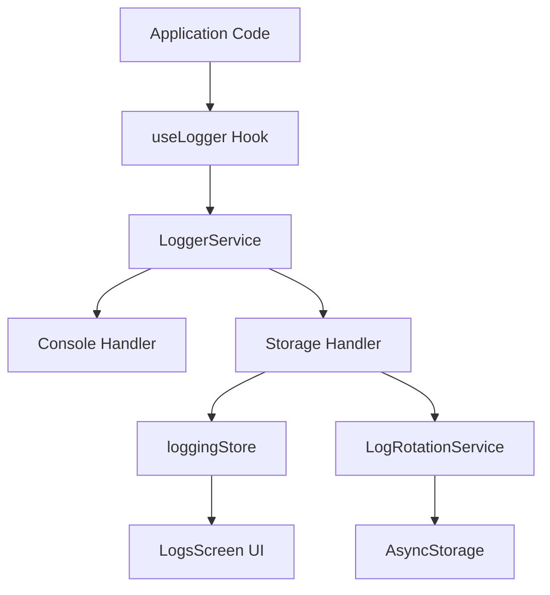
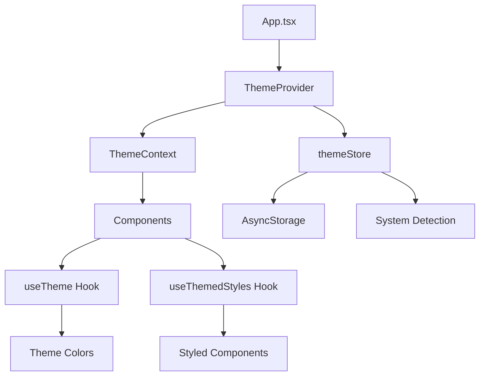

# Implementation Guide

**CB-Pro-Proxy - Logging System & Dark Mode**  
**Version:** 1.0  
**Last Updated:** 2025-01-14

This guide provides comprehensive documentation for the Logging System and Dark Mode features implemented in CB-Pro-Proxy.

---

## Table of Contents

1. [Overview](#overview)
2. [Logging System](#logging-system)
3. [Dark Mode](#dark-mode)
4. [Best Practices](#best-practices)
5. [API Reference](#api-reference)

---

## Overview

CB-Pro-Proxy now includes two major features:

- **Logging System**: Comprehensive logging infrastructure with multiple levels, persistence, and export capabilities
- **Dark Mode**: Full theme system with light/dark modes and system theme detection

Both features are production-ready and fully integrated into the app.

---

## Logging System

### Architecture

The logging system consists of three main components:

1. **LoggerService** ([`src/services/LoggerService.ts`](../src/services/LoggerService.ts:1)) - Core singleton service
2. **LogRotationService** ([`src/services/LogRotationService.ts`](../src/services/LogRotationService.ts:1)) - Handles persistence and cleanup
3. **loggingStore** ([`src/store/loggingStore.ts`](../src/store/loggingStore.ts:1)) - Zustand state management



### Using LoggerService

#### Basic Usage

```typescript
import { logger } from "../services/LoggerService";

// Simple logging
logger.info("VPN connected", "vpn");
logger.error("Connection failed", "network", error);
logger.debug("Profile loaded", "storage", { profileId: "123" });
```

#### Log Levels

Available log levels (in order of severity):

- `debug`: Detailed debugging information
- `info`: General informational messages
- `warn`: Warning messages for potential issues
- `error`: Error messages for failures
- `critical`: Critical errors requiring immediate attention

```typescript
logger.debug("Detailed state info", "app", { state: "active" });
logger.info("User action completed", "ui");
logger.warn("Rate limit approaching", "network");
logger.error("Failed to save", "storage", error);
logger.critical("App crash detected", "app", error);
```

#### Log Categories

Available categories for organizing logs:

- `app`: Application lifecycle events
- `vpn`: VPN connection events
- `network`: Network operations
- `storage`: Storage operations
- `ui`: UI interactions
- `native`: Native module events
- `error`: Error events

### Using useLogger Hook

The [`useLogger`](../src/hooks/useLogger.ts:110) hook provides a convenient React-friendly API:

```typescript
import { useLogger } from "../hooks/useLogger";

function MyComponent() {
  const { logInfo, logError, logDebug } = useLogger({
    defaultCategory: "ui",
  });

  const handlePress = () => {
    logInfo("Button pressed");
    // Logs: [INFO] [ui] Button pressed
  };

  return <Button onPress={handlePress} />;
}
```

#### Specialized Hooks

```typescript
// VPN-specific logging
import { useVPNLogger } from "../hooks/useLogger";

function VPNComponent() {
  const { logInfo, logError } = useVPNLogger(profileId, vpnStatus);

  logInfo("Connection initiated");
  // Automatically includes profileId and vpnStatus
}

// UI-specific logging
import { useUILogger } from "../hooks/useLogger";

function SettingsScreen() {
  const { logInfo } = useUILogger();

  logInfo("Settings opened");
}

// Network-specific logging
import { useNetworkLogger } from "../hooks/useLogger";

function ApiClient() {
  const { logInfo, logError } = useNetworkLogger();

  logInfo("API request", undefined, { endpoint: "/api/data" });
}

// Storage-specific logging
import { useStorageLogger } from "../hooks/useLogger";

function StorageService() {
  const { logInfo } = useStorageLogger();

  logInfo("Profile saved");
}
```

### LogsScreen Component

The [`LogsScreen`](../src/screens/LogsScreen.tsx:49) provides a comprehensive UI for viewing logs:

**Features:**

- Real-time log display
- Filter by level (debug, info, warn, error, critical)
- Filter by category
- Search functionality
- Export logs (JSON format via Share API)
- Clear logs with confirmation
- Shows count statistics

**Accessing LogsScreen:**

The screen is automatically registered in the navigation stack and can be accessed through the app's navigation menu.

### Log Storage and Persistence

#### Storage Strategy

Logs are stored in two locations:

1. **In-Memory Buffer**: Fast access, limited to 1000 entries (FIFO)
2. **AsyncStorage**: Persistent storage with partition-based organization

#### Partition System

Logs are organized by date in partitions:

```
Storage Structure:
├── @cbv_vpn_logs_index (Partition index)
├── @cbv_vpn_logs_2025-01-14 (Daily partition)
├── @cbv_vpn_logs_2025-01-15
└── @cbv_vpn_logs_2025-01-16
```

#### Storage Limits

- **Max per partition**: 5MB
- **Total storage**: 50MB
- **Retention period**: 30 days
- **Auto-cleanup**: Runs daily

### Configuration

Update logger configuration:

```typescript
import { logger } from "../services/LoggerService";

logger.updateConfig({
  enabled: true,
  levels: ["info", "warn", "error"], // Only log these levels
  maxEntries: 2000, // Increase buffer size
  persistLogs: true,
  consoleOutput: __DEV__, // Console in dev only
});
```

Get current configuration:

```typescript
const config = logger.getConfig();
console.log("Logging enabled:", config.enabled);
console.log("Active levels:", config.levels);
```

### Export Logs

Export logs programmatically:

```typescript
import { useLoggingStore } from "../store/loggingStore";

const { exportLogs } = useLoggingStore();

// Export as JSON
const jsonLogs = exportLogs("json");

// Export as CSV
const csvLogs = exportLogs("csv");

// Export as plain text
const textLogs = exportLogs("txt");
```

---

## Dark Mode

### Architecture

The theme system consists of:

1. **Theme Definitions** ([`src/themes/`](../src/themes/lightTheme.ts:1)) - Light and dark color palettes
2. **themeStore** ([`src/store/themeStore.ts`](../src/store/themeStore.ts:1)) - State management
3. **ThemeContext** ([`src/contexts/ThemeContext.tsx`](../src/contexts/ThemeContext.tsx:1)) - React Context provider
4. **Hooks** - [`useTheme`](../src/hooks/useTheme.ts:1) and [`useThemedStyles`](../src/hooks/useThemedStyles.ts:1)



### Using useTheme Hook

Basic usage:

```typescript
import { useTheme } from "../hooks/useTheme";

function MyComponent() {
  const { theme, colors, isDark, setThemeMode } = useTheme();

  return (
    <View style={{ backgroundColor: colors.background.primary }}>
      <Text style={{ color: colors.text.primary }}>
        Current theme: {isDark ? "Dark" : "Light"}
      </Text>
    </View>
  );
}
```

### Using useThemedStyles Hook

The [`useThemedStyles`](../src/hooks/useThemedStyles.ts:101) hook is the recommended way to create theme-aware styles:

```typescript
import { useThemedStyles } from "../hooks/useThemedStyles";
import { StyleSheet } from "react-native";

function MyComponent() {
  const styles = useThemedStyles((theme, colors) =>
    StyleSheet.create({
      container: {
        backgroundColor: colors.background.primary,
        padding: theme.spacing.md,
        borderRadius: theme.borderRadius.lg,
      },
      title: {
        color: colors.text.primary,
        fontSize: theme.typography.fontSize.xl,
        fontWeight: theme.typography.fontWeight.bold,
      },
      button: {
        backgroundColor: colors.interactive.primary,
        padding: theme.spacing.sm,
        borderRadius: theme.borderRadius.md,
      },
    })
  );

  return (
    <View style={styles.container}>
      <Text style={styles.title}>Hello World</Text>
      <TouchableOpacity style={styles.button}>
        <Text>Click Me</Text>
      </TouchableOpacity>
    </View>
  );
}
```

### Theme Colors

#### Background Colors

```typescript
colors.background.primary; // Main background
colors.background.secondary; // Card/section backgrounds
colors.background.tertiary; // Input backgrounds
colors.background.elevated; // Elevated surfaces
```

#### Text Colors

```typescript
colors.text.primary; // Main text
colors.text.secondary; // Subtitles/descriptions
colors.text.tertiary; // Disabled text
colors.text.inverse; // Text on colored backgrounds
```

#### Interactive Colors

```typescript
colors.interactive.primary; // Primary buttons/links
colors.interactive.secondary; // Secondary actions
colors.interactive.disabled; // Disabled state
colors.interactive.hover; // Hover/press state
```

#### Status Colors

```typescript
colors.status.success; // Success messages
colors.status.warning; // Warnings
colors.status.error; // Errors
colors.status.info; // Informational
```

#### VPN-Specific Colors

```typescript
colors.vpn.connected; // VPN connected state
colors.vpn.connecting; // VPN connecting state
colors.vpn.handshaking; // VPN handshaking state
colors.vpn.disconnected; // VPN disconnected state
colors.vpn.error; // VPN error state
```

#### Border Colors

```typescript
colors.border.primary; // Primary borders
colors.border.secondary; // Subtle borders
colors.border.focus; // Focused elements
```

### Theme Tokens

#### Spacing (8pt grid)

```typescript
theme.spacing.xs; // 4px
theme.spacing.sm; // 8px
theme.spacing.md; // 16px
theme.spacing.lg; // 24px
theme.spacing.xl; // 32px
```

#### Border Radius

```typescript
theme.borderRadius.sm; // 4px
theme.borderRadius.md; // 8px
theme.borderRadius.lg; // 12px
theme.borderRadius.xl; // 16px
theme.borderRadius.round; // 999px (circular)
```

#### Typography

```typescript
// Font sizes
theme.typography.fontSize.xs; // 12px
theme.typography.fontSize.sm; // 14px
theme.typography.fontSize.md; // 16px
theme.typography.fontSize.lg; // 18px
theme.typography.fontSize.xl; // 24px
theme.typography.fontSize.xxl; // 32px

// Font weights
theme.typography.fontWeight.normal; // '400'
theme.typography.fontWeight.medium; // '600'
theme.typography.fontWeight.bold; // '700'
theme.typography.fontWeight.heavy; // '800'
```

### Themed Components

The [`ThemedComponents`](../src/components/ThemedComponents.tsx:1) library provides pre-built components:

#### ThemedView

```typescript
import { ThemedView } from "../components/ThemedComponents";

<ThemedView variant="primary">
  <Text>Content</Text>
</ThemedView>;

// Variants: primary, secondary, tertiary, elevated
```

#### ThemedText

```typescript
import { ThemedText } from "../components/ThemedComponents";

<ThemedText variant="primary" size="lg" weight="bold">
  Hello World
</ThemedText>;

// Variants: primary, secondary, tertiary, inverse
// Sizes: xs, sm, md, lg, xl, xxl
// Weights: normal, medium, bold, heavy
```

#### ThemedCard

```typescript
import { ThemedCard } from "../components/ThemedComponents";

<ThemedCard elevated={true}>
  <Text>Card content</Text>
</ThemedCard>;
```

#### ThemedButton

```typescript
import { ThemedButton } from "../components/ThemedComponents";

<ThemedButton
  title="Click Me"
  variant="primary"
  size="md"
  fullWidth={false}
  onPress={handlePress}
/>;

// Variants: primary, secondary, outline, ghost
// Sizes: sm, md, lg
```

#### ThemedSwitch

```typescript
import { ThemedSwitch } from "../components/ThemedComponents";

<ThemedSwitch value={enabled} onValueChange={setEnabled} />;
```

#### ThemedSettingRow

```typescript
import { ThemedSettingRow } from "../components/ThemedComponents";

<ThemedSettingRow
  title="Enable Feature"
  subtitle="Description of feature"
  icon={<Icon name="settings" />}
  rightContent={<Switch />}
  showChevron={true}
  onPress={handlePress}
/>;
```

### Changing Theme

#### Set Theme Mode

```typescript
import { useTheme } from "../hooks/useTheme";

function ThemeSelector() {
  const { themeMode, setThemeMode } = useTheme();

  return (
    <>
      <Button onPress={() => setThemeMode("light")}>Light</Button>
      <Button onPress={() => setThemeMode("dark")}>Dark</Button>
      <Button onPress={() => setThemeMode("system")}>System</Button>
    </>
  );
}
```

#### Toggle Theme

```typescript
function ThemeToggle() {
  const { isDark, setThemeMode } = useTheme();

  const toggle = () => {
    setThemeMode(isDark ? "light" : "dark");
  };

  return <Button onPress={toggle}>{isDark ? "☀️ Light" : "🌙 Dark"}</Button>;
}
```

### Adding New Colors

To add new colors to the theme:

1. Update type definition in [`src/types/theme.ts`](../src/types/theme.ts:1):

```typescript
export interface ColorPalette {
  // ... existing colors
  myNewColor: {
    primary: string;
    secondary: string;
  };
}
```

2. Add colors to both themes in [`src/themes/`](../src/themes/lightTheme.ts:1):

```typescript
// lightTheme.ts
export const lightTheme: Theme = {
  colors: {
    // ... existing colors
    myNewColor: {
      primary: "#FF0000",
      secondary: "#00FF00",
    },
  },
};

// darkTheme.ts
export const darkTheme: Theme = {
  colors: {
    // ... existing colors
    myNewColor: {
      primary: "#FF6666",
      secondary: "#66FF66",
    },
  },
};
```

3. Use in components:

```typescript
const styles = useThemedStyles((theme, colors) =>
  StyleSheet.create({
    container: {
      backgroundColor: colors.myNewColor.primary,
    },
  })
);
```

---

## Best Practices

### Logging Best Practices

#### ✅ Do's

- **Use appropriate log levels**: Don't log everything as `error`
- **Include context**: Add relevant data to help debugging
- **Log state changes**: Track important state transitions
- **Use categories**: Organize logs by functional area
- **Log errors with stack traces**: Always pass Error objects to error logs

```typescript
// Good
logger.info("VPN connected", "vpn", {
  profileId: profile.id,
  duration: connectionTime,
});

logger.error("Failed to save profile", "storage", error, {
  profileId: profile.id,
  operation: "save",
});

// Bad
logger.info("Something happened");
logger.error("Error");
```

#### ❌ Don'ts

- **Don't log sensitive data**: Passwords, tokens, credentials
- **Don't log in tight loops**: Use debouncing if needed
- **Don't use console.log directly**: Always use logger service
- **Don't log redundant information**: Keep logs meaningful
- **Don't block UI with logging**: Logging is async

```typescript
// Bad - sensitive data
logger.info("User login", "auth", {
  password: user.password, // ❌ NEVER
});

// Good - sanitized
logger.info("User login", "auth", {
  userId: user.id,
  method: "credentials",
});

// Bad - tight loop
for (let i = 0; i < 10000; i++) {
  logger.debug("Processing", "app", { index: i }); // ❌
}

// Good - log once
logger.debug("Processing batch", "app", {
  count: 10000,
  startTime: Date.now(),
});
```

### Theme Best Practices

#### ✅ Do's

- **Use theme colors**: Always reference theme colors, never hardcode
- **Use useThemedStyles**: Centralize style creation with theme awareness
- **Use semantic colors**: Choose colors by purpose (e.g., `status.error` not a specific red)
- **Test both themes**: Verify UI in both light and dark modes
- **Use ThemedComponents**: Leverage pre-built components when possible

```typescript
// Good - theme-aware
const styles = useThemedStyles((theme, colors) =>
  StyleSheet.create({
    error: {
      color: colors.status.error, // ✅
      backgroundColor: colors.background.secondary,
    },
  })
);

// Bad - hardcoded
const styles = StyleSheet.create({
  error: {
    color: "#FF0000", // ❌
    backgroundColor: "#FFFFFF",
  },
});
```

#### ❌ Don'ts

- **Don't hardcode colors**: All colors should come from theme
- **Don't mix theme and hardcoded styles**: Be consistent
- **Don't create styles outside components**: They won't update with theme changes
- **Don't forget StatusBar**: Update it based on theme

```typescript
// Bad - won't update on theme change
const styles = StyleSheet.create({
  container: {
    backgroundColor: lightTheme.colors.background.primary, // ❌
  },
});

// Good - updates automatically
const MyComponent = () => {
  const styles = useThemedStyles((theme, colors) =>
    StyleSheet.create({
      container: {
        backgroundColor: colors.background.primary, // ✅
      },
    })
  );
  // ...
};
```

---

## API Reference

### LoggerService

```typescript
class LoggerService {
  // Log methods
  debug(message: string, category: LogCategory, data?: any): void;
  info(message: string, category: LogCategory, data?: any): void;
  warn(message: string, category: LogCategory, data?: any): void;
  error(
    message: string,
    category: LogCategory,
    error?: Error,
    data?: any
  ): void;
  critical(
    message: string,
    category: LogCategory,
    error?: Error,
    data?: any
  ): void;

  // Buffer management
  getLogs(): LogEntry[];
  clearBuffer(): void;
  getBufferSize(): number;

  // Configuration
  updateConfig(config: Partial<LoggerConfig>): void;
  getConfig(): LoggerConfig;
  isEnabled(): boolean;
  enable(): void;
  disable(): void;

  // Handler management
  addHandler(handler: LogHandler): void;
  removeHandler(name: string): void;
}
```

### useLogger Hook

```typescript
interface UseLoggerReturn {
  logDebug: (message: string, category?: LogCategory, data?: any) => void;
  logInfo: (message: string, category?: LogCategory, data?: any) => void;
  logWarn: (message: string, category?: LogCategory, data?: any) => void;
  logError: (
    message: string,
    category?: LogCategory,
    error?: Error,
    data?: any
  ) => void;
  logCritical: (
    message: string,
    category?: LogCategory,
    error?: Error,
    data?: any
  ) => void;
  isEnabled: boolean;
}

function useLogger(options?: {
  defaultCategory?: LogCategory;
  defaultProfileId?: string;
  defaultVPNStatus?: VPNStatus;
}): UseLoggerReturn;
```

### useTheme Hook

```typescript
interface ThemeContextType {
  theme: Theme;
  colors: ColorPalette;
  themeMode: ThemeMode;
  currentTheme: ThemeName;
  isDark: boolean;
  setThemeMode: (mode: ThemeMode) => Promise<void>;
}

function useTheme(): ThemeContextType;
```

### useThemedStyles Hook

```typescript
function useThemedStyles<T extends NamedStyles<T>>(
  styleFactory: (theme: Theme, colors: ColorPalette) => T
): T;
```

---

## Additional Resources

- **Design Document**: [`FEATURE_DESIGN.md`](./FEATURE_DESIGN.md)
- **Testing Guide**: [`TESTING_GUIDE.md`](./TESTING_GUIDE.md)
- **Quick Start**: [`QUICK_START.md`](./QUICK_START.md)
- **Main README**: [`README.md`](../README.md)

---

## Support

For issues or questions:

1. Check the [Testing Guide](./TESTING_GUIDE.md) for common problems
2. Review the [Feature Design Document](./FEATURE_DESIGN.md) for architecture details
3. Create an issue in the project repository
